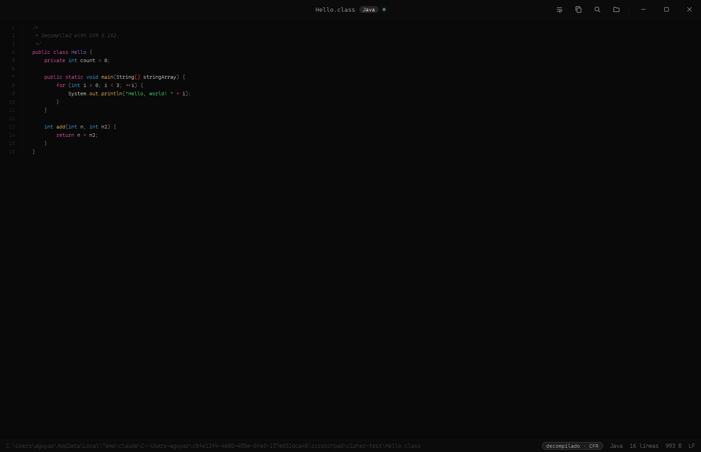

<div align="center">

# Cipher

**Visor de código dark, minimalista y frameless para Windows.**

Resalta más de 250 lenguajes y *decompila* `.class` de Java al vuelo. Un solo `.exe` portable.



Hermano de [Folio](https://github.com/agustinyarrus/folio) · [Lumen](https://github.com/agustinyarrus/lumen) · [Lux](https://github.com/agustinyarrus/lux).

</div>

---

## Qué es

Cipher abre cualquier archivo de código y lo muestra **bien formateado**: resaltado de sintaxis,
números de línea, búsqueda, ajuste de línea, zoom y recarga en vivo. Es **solo lectura** — pensado
para *leer* código lindo, no para editarlo.

Todo el trabajo de resaltado vive en Go (vía [chroma](https://github.com/alecthomas/chroma), un port
de Pygments): sin CDNs, sin dependencias en tiempo de ejecución. La UI es una ventana
[WebView2](https://developer.microsoft.com/microsoft-edge/webview2/) **sin marco del sistema**: la
barra de título y los botones los dibuja la propia app, con **Onyx/Prism** — cromo negro puro
monocromo y el código en un arcoíris neón pleno — y tipografía Cascadia Code.

## Características

- **+250 lenguajes** detectados por extensión, nombre de archivo o contenido.
- **Decompilación de `.class`** (bytecode de Java) → fuente Java legible, vía [CFR](https://github.com/leibnitz27/cfr)
  embebido (con `javap` del JDK como respaldo). Requiere Java instalado sólo para esto.
- **Números de línea** con gutter fijo, búsqueda incremental (`Ctrl F`), **ajuste de línea** (`W`),
  zoom (`Ctrl ±` / `Ctrl` + rueda), copiar todo (`Ctrl C`) y **pantalla completa** (`F`).
- **Recarga en vivo**: si el archivo cambia en disco, la vista se actualiza sola.
- **Barra de estado** con lenguaje, líneas, tamaño, codificación (LF/CRLF) y si vino decompilado.
- **Arrastrar y soltar** cualquier archivo. Instancia única (daemon caliente: reabrir es instantáneo).
- Un solo **`.exe` portable** (~17 MB), dark y frameless desde el primer pixel (sin flash blanco).

## Atajos

| Tecla | Acción | | Tecla | Acción |
|---|---|---|---|---|
| `Ctrl O` | Abrir | | `W` | Ajuste de línea |
| `Ctrl F` | Buscar | | `Ctrl ±` | Zoom |
| `Ctrl C` | Copiar todo | | `F` | Pantalla completa |
| `g` / `G` | Inicio / fin | | `j` / `k` | Bajar / subir |

## Build

Requiere [Go](https://go.dev) 1.24+ y Windows con [WebView2 Runtime](https://developer.microsoft.com/microsoft-edge/webview2/)
(viene con Windows 11).

```powershell
.\build.ps1            # genera cipher.exe (release, sin consola)
.\build.ps1 -Debug     # genera cipher-debug.exe (consola + logs; --dump <archivo> vuelca el render)
```

El icono (`cipher.ico`) se genera con `.\gen-icon.ps1` y se embebe vía `rsrc.syso`.

## Instalar

```powershell
.\install.ps1            # instala en Program Files + Menú de Inicio (UAC). Se auto-eleva.
.\install.ps1 -Uninstall # desinstala
```

La instalación agrega Cipher al menú **"Abrir con"** de los archivos de código y registra `.class`,
pero **no cambia tus aplicaciones por defecto** — tus editores quedan intactos.

## Licencia

[MIT](LICENSE). Incluye [CFR](https://github.com/leibnitz27/cfr) (MIT) para decompilar `.class`.
