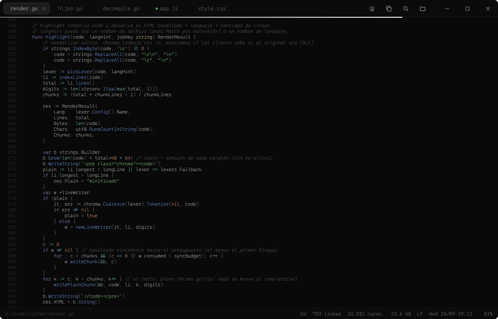

<div align="center">

# Cipher

**Visor de código dark, minimalista y frameless para Windows.**

Resalta más de 250 lenguajes y *decompila* `.class` de Java al vuelo. Un solo `.exe` portable.



Hermano de [Folio](https://github.com/agustinyarrus/folio) · [Lumen](https://github.com/agustinyarrus/lumen) · [Lux](https://github.com/agustinyarrus/lux).

</div>

---

## Qué es

Cipher abre cualquier archivo de código y lo muestra **bien formateado**: resaltado de sintaxis,
números de línea, búsqueda, ajuste de línea, zoom y recarga en vivo. Es **solo lectura** — pensado
para *leer* código lindo, no para editarlo.

Todo el trabajo de resaltado vive en Go (vía [chroma](https://github.com/alecthomas/chroma), un port
de Pygments): sin CDNs, sin dependencias en tiempo de ejecución. La UI es una ventana
[WebView2](https://developer.microsoft.com/microsoft-edge/webview2/) **sin marco del sistema**: la
barra de título y los botones los dibuja la propia app, con **Onyx/Prism** — cromo negro puro
monocromo y el código en un arcoíris pastel (familia Catppuccin) — y tipografía Cascadia Code
ExtraLight, apoyada siempre en la grilla de píxeles físicos.

## Características

- **+250 lenguajes** detectados por extensión, nombre de archivo o contenido.
- **Pestañas**: cada archivo abre en su pestaña (sin duplicar), con cambio instantáneo que conserva
  el scroll. Con un solo archivo la barra queda limpia como siempre; la tira aparece recién con dos.
  Si un archivo de una pestaña en segundo plano cambia en disco, un punto verde lo delata.
- **Decompilación de `.class`** (bytecode de Java) → fuente Java legible, vía [CFR](https://github.com/leibnitz27/cfr)
  embebido (con `javap` del JDK como respaldo). Requiere Java instalado sólo para esto.
- **Números de línea** con gutter fijo, **ajuste de línea** (`W`), zoom (`Ctrl ±` / `Ctrl` + rueda),
  copiar todo (`Ctrl C`), **ir a línea** (`Ctrl G`, acepta `120:8` y negativos desde el final) y
  **pantalla completa** (`F`).
- **Búsqueda** (`Ctrl F` o `/`) que cruza tokens (`func main` se encuentra aunque sean tres colores),
  con **Aa** (mayúsculas), **ab** (palabra entera, con bordes Unicode) y **.\*** (expresión regular).
- **Archivos grandes**: se abren al instante y se terminan de resaltar en segundo plano (un `.go` de
  5 MB: 0,6 s en vez de 9 s; un `.log` de 12 MB: 0,1 s en vez de 69 s). El navegador solo dibuja los
  bloques de renglones que están a la vista. Un minificado (renglones de más de 16 KB) va plano.
- **Recarga en vivo**: si el archivo cambia en disco, la vista se actualiza sola **sin moverse del
  renglón que estabas leyendo**; si lo borran, la pestaña lo avisa (y vuelve sola si reaparece).
- **Zonas marcadas** para revisar cambios: `cipher archivo.go --hl "+30-36,-3-8,96-97"` resalta
  renglones con semántica de diff (verde = agregado, rojo = borrado, crema = modificado) y salta a
  la primera; `n` / `p` recorren las zonas.
- **Barra de estado** con lenguaje, líneas, tamaño, codificación (también UTF-16 sin BOM), fin de
  línea (LF / CRLF / **Mixto**) y si vino decompilado.
- **Arrastrar y soltar** uno o varios archivos; el diálogo de abrir también acepta multi-selección,
  y `cipher a.go b.go c.go` abre los tres. Instancia única (daemon caliente: reabrir es instantáneo).
- Un solo **`.exe` portable** (~13 MB), dark y frameless desde el primer pixel (sin flash blanco).
- **Solo local de verdad**: el servidor interno responde únicamente a su propia dirección
  (`127.0.0.1:puerto`), así una página web no puede usar DNS rebinding para leer archivos del disco.

## Atajos

| Tecla | Acción | | Tecla | Acción |
|---|---|---|---|---|
| `Ctrl O` | Abrir | | `W` | Ajuste de línea |
| `Ctrl F` | Buscar | | `Ctrl ±` | Zoom |
| `Ctrl C` | Copiar todo | | `F` | Pantalla completa |
| `Ctrl Tab` | Pestaña siguiente / anterior | | `Ctrl W` | Cerrar pestaña |
| `Ctrl 1…9` | Ir a la pestaña n | | rueda sobre la tira | Desplazar pestañas |
| `Ctrl G` | Ir a línea | | `/` | Buscar |
| `n` / `p` | Siguiente / anterior (coincidencia o zona) | | `Alt C` / `Alt W` / `Alt R` | Aa / ab / .* en la búsqueda |
| `g` / `G` | Inicio / fin | | `j` / `k` | Bajar / subir |

## Build

Requiere [Go](https://go.dev) 1.24+ y Windows con [WebView2 Runtime](https://developer.microsoft.com/microsoft-edge/webview2/)
(viene con Windows 11).

```powershell
.\build.ps1            # genera cipher.exe (release, sin consola)
.\build.ps1 -Debug     # genera cipher-debug.exe (consola + logs; --dump <archivo> vuelca el render)
```

El icono (`cipher.ico`) es un diseño hecho a mano y se embebe vía `rsrc.syso`. (`gen-icon.ps1`
genera el glifo `</>` original: no correrlo, pisaría el diseño actual.)

## Instalar

```powershell
.\install.ps1            # instala en Program Files + Menú de Inicio (UAC). Se auto-eleva.
.\install.ps1 -Uninstall # desinstala
```

La instalación agrega Cipher al menú **"Abrir con"** de los archivos de código y registra `.class`,
pero **no cambia tus aplicaciones por defecto** — tus editores quedan intactos.

## Licencia

[MIT](LICENSE). Incluye [CFR](https://github.com/leibnitz27/cfr) (MIT) para decompilar `.class`.
