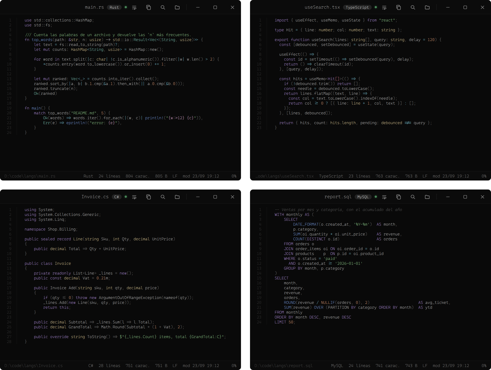
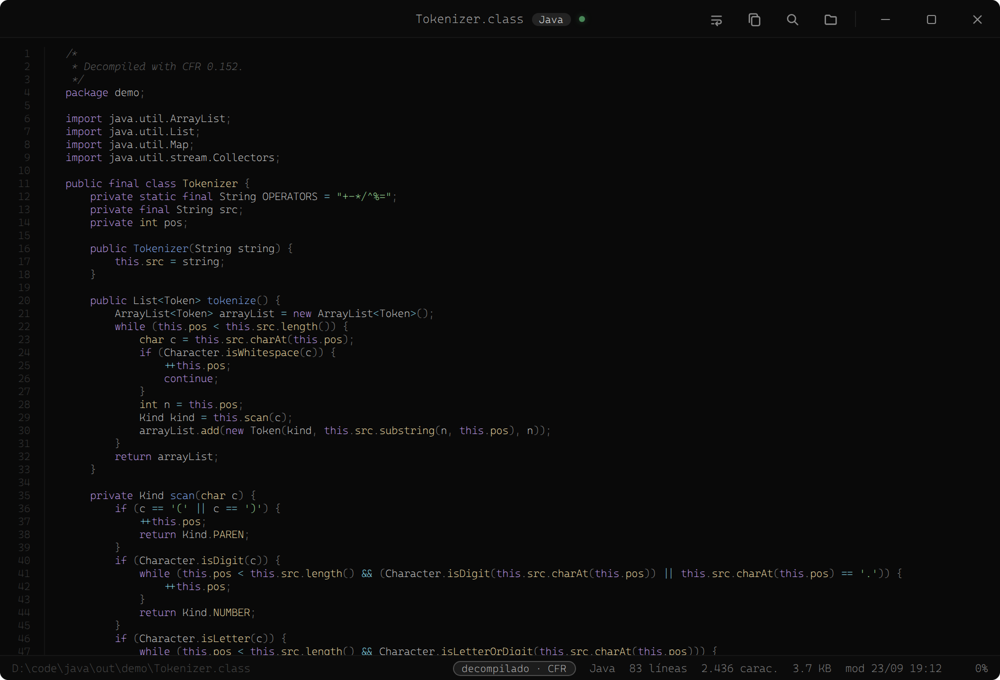
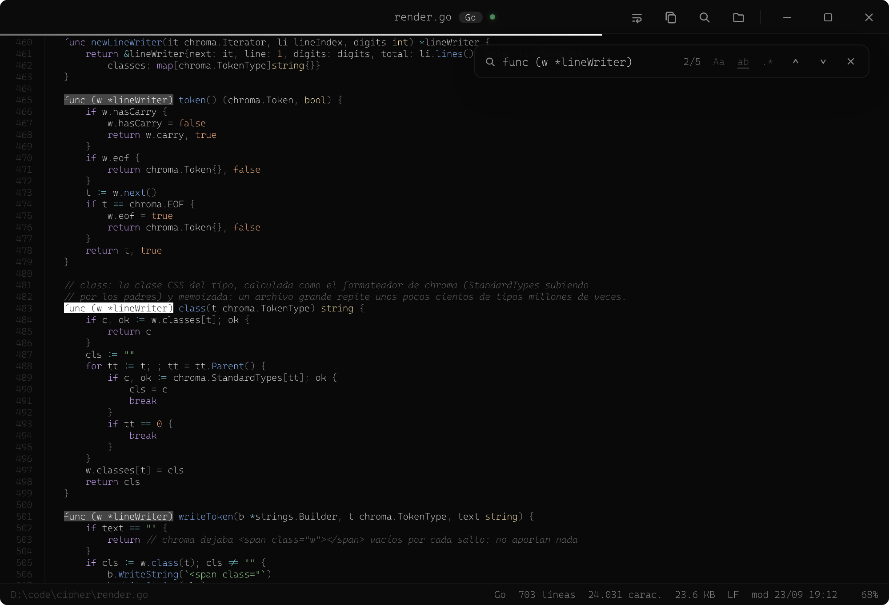
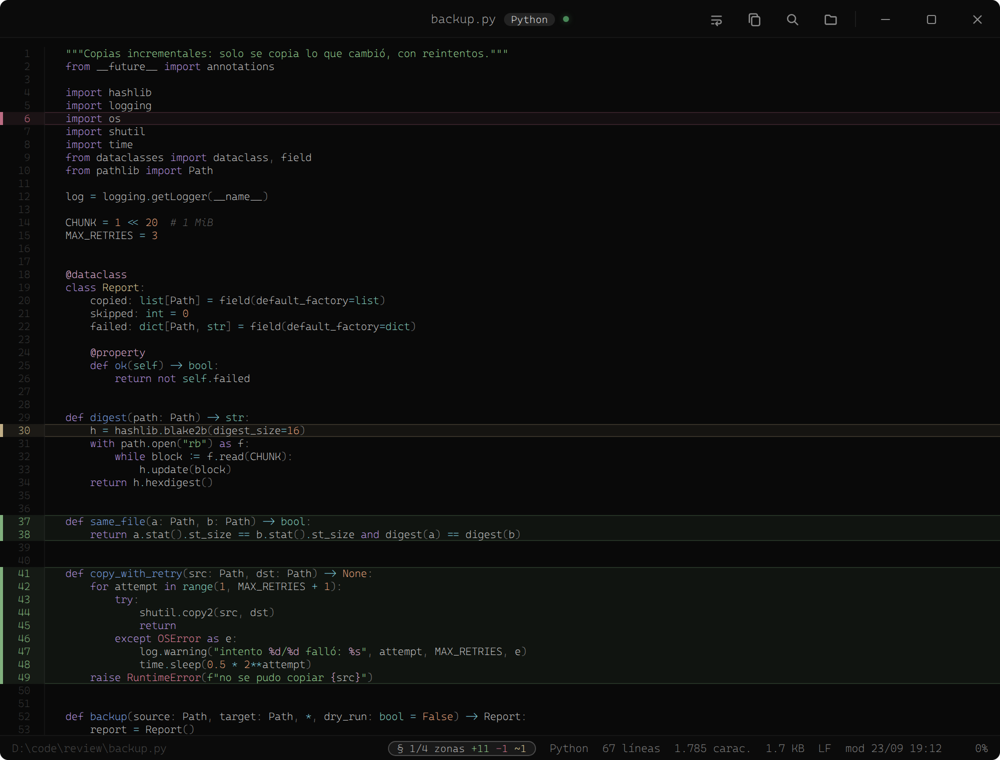

<div align="center">

# Cipher

**Un visor de código dark, frameless y ultraminimalista para Windows.**

Resalta **más de 250 lenguajes** y *decompila* `.class` de Java al vuelo. Todo el resaltado vive en
Go: sin Electron, sin CDN, sin dependencias en tiempo de ejecución. Un solo `.exe` portable.


[](https://github.com/agustinyarrus/cipher/releases/latest)
[](https://github.com/agustinyarrus/cipher/releases)


Hermano de [Folio](https://github.com/agustinyarrus/folio) · [Lumen](https://github.com/agustinyarrus/lumen) · [Lux](https://github.com/agustinyarrus/lux).

</div>

---

## ✨ Qué es

**Cipher** abre cualquier archivo de código y lo muestra **bien formateado**: resaltado de sintaxis,
números de línea, pestañas, búsqueda, zoom y recarga en vivo. Es **solo lectura**, pensado para
*leer* código lindo, no para editarlo: el visor que querés en el menú **"Abrir con"** para mirar un
archivo sin esperar a que arranque un IDE.

Es una sola ventana [WebView2](https://developer.microsoft.com/microsoft-edge/webview2/) **sin marco
del sistema**: la barra de título, las pestañas y los botones los dibuja la propia app. El cromo es
**Onyx** (negro puro y monocromo) y el código va en un **arcoíris pastel** (familia Catppuccin), en
Cascadia Code ExtraLight apoyada siempre en la grilla de píxeles físicos. El resaltado lo hace **Go**
con [chroma](https://github.com/alecthomas/chroma) (un port de Pygments) compilado dentro del `.exe`:
**funciona 100 % offline**.

## 🔤 Lenguajes

Todo lo que chroma sabe resaltar: **297 lexers** y **496 extensiones**, de `.go` a `.zig`, pasando por
`Dockerfile`, `.ps1`, `.sql`, `.tf`, `.proto` o `.vue`. El lenguaje sale del **nombre del archivo**
(la extensión, o nombres especiales como `Dockerfile` y `Makefile`) y, si con eso no alcanza, del
**contenido**.



- **Codificaciones de Windows**: un `.reg` exportado por regedit, un `.ps1` del ISE o un `.txt` del
  Bloc de notas suelen venir en **UTF-16**; Cipher los decodifica solo, con o sin BOM, y la barra de
  estado dice cuál era (`UTF-16 LE`, `UTF-8 BOM`…).
- **Fin de línea** a la vista: `LF`, `CRLF`, `CR` o **`Mixto`**, el clásico archivo con finales
  mezclados después de un merge.
- **Binarios**: un aviso en el centro en vez de un montón de basura (la heurística de git: un byte
  NUL en los primeros 8 KB).

## ☕ `.class` decompilado

Abrí un `.class` y vas a ver **Java fuente**, no bytecode: Cipher lo pasa por
[CFR](https://github.com/leibnitz27/cfr), que viaja **embebido** en el `.exe`, y resalta el resultado
como cualquier otro archivo. Si las clases internas (`Tokenizer$Token.class`…) están al lado, salen
en el mismo archivo.



- Hace falta **Java** instalado (el `java` del `PATH` o el de `JAVA_HOME`). Para todo lo demás, no.
- Si CFR no puede, prueba con `javap -p -c` del JDK (desensamblado, menos lindo pero siempre está).
- Cada decompilación tiene un tope de 30 s y se recuerdan las últimas 32: volver a un `.class`
  que ya abriste es instantáneo, y si el archivo cambia se decompila de nuevo.
- La barra de estado lo avisa con la pill `decompilado · CFR`.

## 🔍 Búsqueda que cruza tokens

`Ctrl F` (o `/`) busca sobre el **texto de cada renglón**, no nodo por nodo: `func (w *lineWriter)` se
encuentra aunque sean seis colores distintos. Las coincidencias se pintan con la CSS Custom Highlight
API, sin tocar el DOM del código.



- **Aa** distingue mayúsculas, **ab** busca la palabra entera (entiende tildes y eñes: `año` no
  aparece dentro de `añoso`) y **.\*** activa las expresiones regulares. Se prenden con `Alt C`,
  `Alt W` y `Alt R`.
- Arranca por la coincidencia **más cercana a lo que estás leyendo**; `Enter` / `Shift Enter` (o
  `n` / `p`) recorren. Una regex a medio escribir se pone en rojo en vez de romper nada.
- **Ir a línea** con `Ctrl G`: acepta `120`, `120:8` (lo que escupen los compiladores) y negativos
  (`-1` es el último renglón), y destella el renglón al llegar.

## 🟩 Zonas marcadas (`--hl`)

Para **revisar cambios**: abrí un archivo señalando renglones, con semántica de diff. Ideal para que
un script, un hook de git o un asistente de código te muestre qué tocó.

```powershell
& "$env:ProgramFiles\Cipher\cipher.exe" backup.py --hl "-6,30,+37-38,+41-49"
```

| Prefijo | Color | Significa |
|---|---|---|
| `+` | verde | agregado |
| `-` | rojo | borrado |
| *(ninguno)* | crema | modificado |



Cipher salta a la primera zona; `n` / `p` (o un clic en la pill `§`) recorren las demás. Las marcas
sobreviven a la recarga en vivo, le llegan también a la ventana que ya estaba abierta, y abrir el
mismo archivo sin `--hl` las limpia. Se aplican al **primer** archivo de la línea de comandos; los
rangos se escriben `12-15,40,60-72` y lo que no se entiende se ignora en silencio.

## 🎛️ Características

- **Pestañas**: cada archivo abre en la suya, sin duplicar (la misma ruta vuelve a su pestaña), y
  cambiar es instantáneo y conserva el scroll. Con un solo archivo la barra queda limpia como
  siempre; la tira aparece recién con dos. Si un archivo cambia en disco mientras su pestaña está de
  fondo, un **punto verde** lo delata; si lo borran, el nombre aparece tachado.
- **Recarga en vivo**: si el archivo cambia, la vista se actualiza sola **sin moverse del renglón
  que estabas leyendo**. Espera a que el editor termine de guardar, mira fecha *y* tamaño, no
  repinta si el contenido es el mismo y, si el archivo desaparece, lo avisa (y vuelve solo si
  reaparece).
- **Archivos grandes al instante**: las primeras pantallas llegan resaltadas y el resto se termina
  de resaltar en segundo plano, reemplazándose en su lugar sin que la vista se mueva (pill
  `resaltando N%`). El navegador solo dibuja los bloques de renglones que están a la vista: un
  archivo de 300 mil renglones se recorre sin trabas. Un minificado (renglones de más de 16 KB) va
  plano, y lo que pasa de 12 MB se recorta en un renglón entero y se avisa.
- **Barra de estado** con todo: ruta, lenguaje, líneas, caracteres, tamaño, codificación, fin de
  línea, fecha de modificación (`hoy 13:24`, `22/07 13:24`), porcentaje de lectura, caracteres
  seleccionados (`sel 42`) y el zoom cuando no está al 100 %.
- **Números de línea** en un gutter fijo que no se va con el scroll horizontal, y una línea de
  progreso de lectura bajo la barra de título.
- **Zoom** (`Ctrl ±` / `Ctrl` + rueda, de 60 % a 220 %), **ajuste de línea** (`W`), **copiar todo**
  (`Ctrl C` sin selección) y **pantalla completa** (`F`).
- **Abrir de todas las formas**: el diálogo nativo con multi-selección (`Ctrl O`), "Abrir con" /
  "Editar con Cipher" desde el Explorador, la línea de comandos, o arrastrar y soltar uno o varios
  archivos (lo que se suelta llega sin ruta: se ve igual, pero sin recarga en vivo).
- **Instancia única**: la primera ventana queda viva y cada `cipher.exe` siguiente le pasa el
  archivo y sale, sin volver a pagar el arranque de WebView2. Reabrir es instantáneo.
- **Frameless de verdad**: esquinas redondeadas y borde oscuro de Windows 11, Aero Snap intacto, y
  la ventana nace oscura desde el primer pixel (sin flash blanco) en el tamaño y lugar en que la
  dejaste.
- **Solo local de verdad**: el servidor interno responde únicamente a su propia dirección
  (`127.0.0.1:puerto`), así una página web no puede usar DNS rebinding para leer archivos del disco
  a través de él.

## 🎨 Paleta y tipografía

El cromo es **Onyx**: negro puro, monocromo, con el blanco como único acento (el verde y el rojo
quedan para lo funcional: recarga en vivo, cerrar, errores). El código va en un **arcoíris pastel**
repartido para que ningún lenguaje quede dominado por un solo color:


Todo va en **Cascadia Code ExtraLight** (200), el corte más fino que existe, sin negritas ni
cursivas sintéticas. El cuerpo del código cae en **16 px físicos** a 150 % de escala (el tamaño
óptico de Notepad++ a 10 pt) con renglones de 20 px, y en cualquier zoom o monitor la app redondea
cuerpo e interlineado al **píxel físico entero**: si el renglón midiera 18,6 px, cada línea apoyaría
en un subpíxel distinto y el trazo fino se ablandaría. Solo por debajo de 6 pt sube a Light (300),
porque ahí el trazo ya mide menos de un píxel.

## ⚡ Rendimiento

Lo que cambió de 1.0 a 1.1 con el motor nuevo: un formateador propio en streaming (mismas clases y
mismo escapado que el de chroma, sin juntar millones de tokens en memoria) y el resaltado progresivo
por bloques de 256 renglones.

| Archivo | 1.0 | 1.1 |
|---|---|---|
| `.go` de 5 MB | 9 s | **0,6 s** (el resto se resalta en segundo plano) |
| `.log` de 12 MB | 69 s | **0,1 s** |
| `.js` minificado, 2 MB en un solo renglón | 12 s | **al instante** (va plano) |

El `.log` era lento por la detección de lenguaje, que analizaba el archivo entero: ahora mira solo
los primeros 16 KB (de 66 s a 3 ms). Los topes quedan custodiados por `TestLargeFilesAreFast`.

## ⌨️ Atajos

| Tecla | Acción |
|---|---|
| `Ctrl O` | Abrir (multi-selección) |
| `Ctrl F` / `/` | Buscar |
| `Enter` / `Shift Enter` | Coincidencia siguiente / anterior |
| `Alt C` / `Alt W` / `Alt R` | **Aa** / **ab** / **.\*** en la búsqueda |
| `Ctrl G` | Ir a línea (`120`, `120:8`, `-1`) |
| `n` / `p` | Siguiente / anterior: coincidencia o zona marcada |
| `Ctrl Tab` / `Ctrl Shift Tab` | Pestaña siguiente / anterior (también `Ctrl PgDn` / `Ctrl PgUp`) |
| `Ctrl 1…9` | Ir a la pestaña n |
| `Ctrl W` / clic del medio | Cerrar pestaña |
| rueda sobre la tira | Desplazar las pestañas |
| `Ctrl C` | Copiar todo (sin selección) |
| `Ctrl +` / `Ctrl -` / `Ctrl 0` | Zoom / 100 % (también `Ctrl` + rueda) |
| `W` | Ajuste de línea |
| `F` / `F11` | Pantalla completa (`Esc` sale) |
| `g` / `G` | Inicio / fin (también `Inicio` / `Fin`) |
| `j` / `k` | Bajar / subir |
| `Espacio` / `Shift Espacio` | Página abajo / arriba (también `PgDn` / `PgUp`) |
| doble clic en la barra | Maximizar / restaurar |

## 💻 Línea de comandos

> [!NOTE]
> Windows ya trae su propio `cipher.exe`: la herramienta de cifrado EFS, en `System32`, que en la
> terminal tiene prioridad. Llamá a Cipher por su ruta completa o dejate un alias en el perfil de
> PowerShell (`$PROFILE`), apuntando a la carpeta donde lo instalaste o descomprimiste.

```powershell
Set-Alias cph "$env:ProgramFiles\Cipher\cipher.exe"

cph archivo.go                            # abre (o se lo pasa a la ventana que ya está abierta)
cph render.go hljob.go app.js             # una pestaña por archivo
cph backup.py --hl "-6,30,+37-38,+41-49"  # zonas marcadas en el primero
cph --exts extensiones.txt                # las 496 extensiones que reconoce (install.ps1 la usa)
```

Con la variable `CIPHER_NEW=1` se abre una ventana nueva en vez de pasarle el archivo a la que ya
está abierta. El build de depuración (`cipher-debug.exe`) escribe logs en la consola con
`CIPHER_DEBUG=1` y tiene `--dump <archivo>`, que vuelca los metadatos y el HTML del render sin abrir
la ventana.

## ⚙️ Configuración

Cipher guarda sus preferencias en **`%AppData%\Cipher\config.json`** (se crea solo): el zoom del
código, el ajuste de línea y la geometría de la ventana, en píxeles físicos, que se guarda al
cerrarla.

```json
{
  "rscale": 1,
  "wrap": false,
  "window": { "x": 380, "y": 160, "w": 1770, "h": 1260, "max": false }
}
```

Viven del lado del servidor y no en el `localStorage` del navegador porque el servidor interno
escucha en un puerto distinto en cada arranque, y cada puerto sería un origen nuevo sin memoria. El
resto (el perfil de WebView2, el lock de la instancia única y el `cfr.jar` extraído) va en
`%LocalAppData%\Cipher`.

## 📦 Instalación

Desde [**Releases**](https://github.com/agustinyarrus/cipher/releases/latest):

| Archivo | Qué es |
|---|---|
| `Cipher-Setup-<versión>.exe` | Instalador con asistente: por usuario (sin admin) o para todos. Opcionalmente registra Cipher en el menú "Abrir con" de todas las extensiones de código |
| `Cipher-<versión>-portable.zip` | Portable: descomprimir y listo |
| `cipher.exe` | El ejecutable solo |

Necesita el [runtime de WebView2](https://developer.microsoft.com/microsoft-edge/webview2/), que
viene de fábrica en Windows 11.

O desde el código:

```powershell
git clone https://github.com/agustinyarrus/cipher.git
cd cipher
.\build.ps1      # compila cipher.exe (release, sin consola, con icono)
.\install.ps1    # instala en Program Files + Menú de Inicio (UAC; se auto-eleva)
```

`install.ps1` agrega Cipher al menú **"Abrir con"** de las 496 extensiones y suma un
**"Editar con Cipher"** al clic derecho (en el menú nuevo de Windows 11 aparece dentro de "Mostrar
más opciones"). Ninguno de los dos instaladores **cambia tus aplicaciones por defecto**: tus
editores quedan intactos. `.\install.ps1 -Uninstall` revierte todo.

## 🔨 Compilar

Requiere [Go](https://go.dev) 1.25 (con `GOTOOLCHAIN=auto`, que `build.ps1` ya activa, un Go más
viejo se baja el toolchain solo) y Windows; para correrlo, el runtime de WebView2.

```powershell
.\build.ps1            # genera cipher.exe (release, sin consola)
.\build.ps1 -Debug     # genera cipher-debug.exe (consola + logs; --dump <archivo> vuelca el render)
go test ./...          # el motor: resaltado, bloques, decodificación, --hl, recarga
ISCC cipher.iss        # el instalador (Inno Setup 6) -> dist\Cipher-Setup-x.y.z.exe
```

Los tests comparan el formateador propio contra el de chroma en 14 casos, verifican que el
resaltado progresivo termine byte a byte igual que uno hecho de una vez y cuidan los tiempos de los
archivos grandes, la decodificación UTF-16 con y sin BOM, los finales de línea, el recorte, la spec
de `--hl` y la defensa contra DNS rebinding.

El icono (`cipher.ico`) es un diseño hecho a mano y se embebe vía `rsrc.syso`. (`gen-icon.ps1`
genera el glifo `</>` original: no correrlo, pisaría el diseño actual.)

## 🏗️ Arquitectura

| Archivo | Rol |
|---|---|
| `main.go` | Host frameless (WebView2 + Win32), servidor HTTP local, instancia única, bus SSE, recarga en vivo y `--hl` |
| `render.go` | El motor: detección de lenguaje, decodificación, binarios, recorte, formateador en streaming por bloques y la paleta |
| `hljob.go` | Resaltado progresivo de los archivos grandes en segundo plano (cancelable, con cupo de CPU) |
| `decompile.go` | Capa de decompilación: `.class` → CFR, con `javap` de respaldo; extensible por extensión |
| `config.go` | Preferencias persistentes (`%AppData%\Cipher\config.json`) |
| `winapi.go` | Diálogo nativo de apertura con multi-selección, pantalla completa, abrir enlaces |
| `webview_bg.go` | Fondo negro del `about:blank` de WebView2 (anti-flash) |
| `ui/` | HTML + CSS + JS embebidos (`//go:embed`): pestañas, búsqueda, zonas, escala tipográfica |
| `tools/cfr.jar` | CFR 0.152 embebido; se extrae a `%LocalAppData%\Cipher` la primera vez |
| `engine_test.go` · `render_test.go` | Tests del motor |
| `build.ps1` · `install.ps1` · `cipher.iss` | Build, instalación por script e instalador Inno Setup |

`cipher.exe` levanta un servidor en `127.0.0.1` (puerto efímero) que sirve la UI embebida y
responde `/render`: lee el archivo (a lo sumo 12 MB), lo decodifica, decide si es binario o
decompilable, elige el lexer y devuelve el HTML en bloques de 256 renglones junto con los metadatos
de la barra de estado. La ventana WebView2 muestra esa página, y **un solo** canal SSE (`/bus`) le
avisa las aperturas que llegan de otra instancia, los cambios en disco y los bloques recién
resaltados. (Uno solo porque Chromium permite 6 conexiones por host: con un canal por pestaña, la
séptima apertura quedaba esperando para siempre.)

## 📄 Licencia

MIT © Agustín Yarrus — ver [LICENSE](LICENSE). Incluye [CFR](https://github.com/leibnitz27/cfr) 0.152
(MIT, © Lee Benfield) para decompilar `.class` — ver [tools/CFR-LICENSE.txt](tools/CFR-LICENSE.txt).
